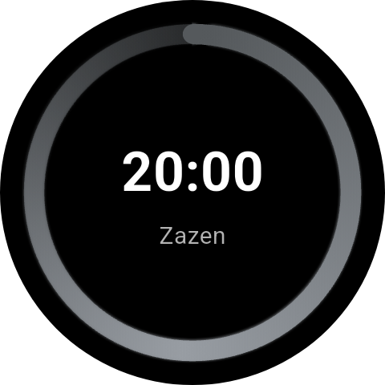
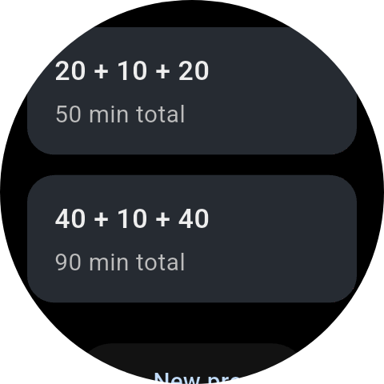
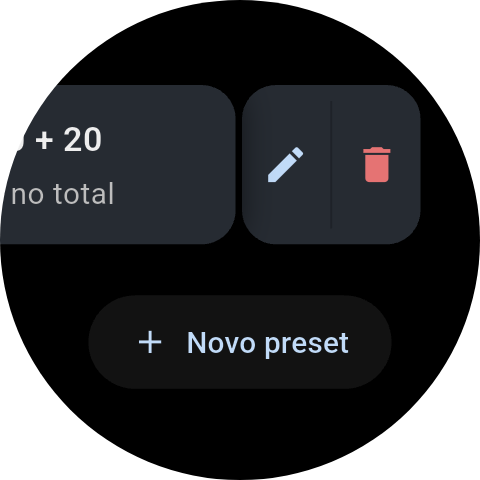

<p align="center">
  
</p>

<h1 align="center">Zazen Timer (Wear OS / Flutter)</h1>

<p align="center">
  A minimalist Zen meditation timer for Wear OS.
</p>

## Screenshots

<p align="center">
  
  
  
  
</p>

## Features

- **Configurable session presets** with multiple steps:
  - Pre-start (time before zazen actually begins)
  - Zazen blocks
  - Optional kinhin blocks between zazen periods
- **Haptic-only guidance**:
  - Three medium vibrations when zazen starts
  - Two medium vibrations when transitioning from zazen to kinhin
  - Three medium vibrations when transitioning from kinhin back to zazen
  - One long vibration at the end of the session
- **Circular countdown display** similar to Samsung timers, with:
  - Large, centered remaining time
  - Progress ring around the watch face
- **Runs in background** — timer continues when the app is in the background or the screen is off.

## Running

1. Ensure you have Flutter installed and configured for Wear OS / Android.
2. From this directory, run:

```bash
flutter pub get
dart run flutter_launcher_icons   # (re)generate app icons
flutter run
```

You may want to create a separate Android Wear OS module or integrate this `lib/` and `pubspec.yaml` into a full Flutter project created via `flutter create`.

## Build and install release APK on the watch

1. **Build the release APK**

   From the project directory:

   ```bash
   flutter build apk --release
   ```

   The APK is produced at: `build/app/outputs/flutter-apk/app-release.apk`

   **Release signing:** When `android/key.properties` and `android/upload-keystore.jks` exist, release builds are signed with that keystore. These files are not committed (see `android/.gitignore`). Without them, the release build falls back to debug signing so the project still builds. The default keystore uses a placeholder password (`changeme`); for production (e.g. Play Store), regenerate the keystore with a strong password (`keytool -genkey -v -keystore android/upload-keystore.jks ...`), update `android/key.properties` with the real passwords, and keep the keystore and passwords in a secure place. For CI, provide them via secrets and inject into the build environment.

   > Release builds use `isMinifyEnabled = false` in `android/app/build.gradle.kts` to avoid an R8/ProGuard parse error from a dependency. The APK is larger but works reliably.

2. **Enable developer options on the watch**

   - **Settings → About** → tap **Build number** 7 times.
   - **Settings → Developer options** → enable **ADB debugging** and **Debug over Wi‑Fi** (or **Wireless debugging** on Wear OS 3/4).
   - Note the watch IP and, for Wireless debugging, the pairing and connection ports.

3. **Connect from your machine**

   Ensure the watch and your computer are on the same Wi‑Fi network. Install `adb` if needed (e.g. `sudo apt install android-tools-adb` on Debian/Ubuntu).

   On **Wear OS 3+** with Wireless debugging you may need to pair first, then connect:

   ```bash
   adb pair <WATCH_IP>:<PAIRING_PORT>
   # Enter the pairing code shown on the watch when prompted.

   adb connect <WATCH_IP>:<CONNECT_PORT>
   adb devices   # confirm the watch is listed
   ```

   On older Wear OS with **Debug over Wi‑Fi**, use:

   ```bash
   adb connect <WATCH_IP>:5555
   adb devices
   ```

4. **Install the release APK**

   From the project directory:

   ```bash
   adb install -r build/app/outputs/flutter-apk/app-release.apk
   ```

   The `-r` flag allows replacing an existing install (e.g. a debug build). Open the app from the watch app list.

### Building an app bundle (AAB) for Play Store

To build a release app bundle:

```bash
flutter build appbundle --release
```

The AAB is produced at `build/app/outputs/bundle/release/app-release.aab`.

If you see **"Release app bundle failed to strip debug symbols from native libraries"**:

- If the verbose log says **"Failed to find cmdline-tools"**, install the Android SDK Command-line Tools (Android Studio: SDK Manager → SDK Tools → **Android SDK Command-line Tools (latest)**; or run `sdkmanager "cmdline-tools;latest"` if on PATH). Then run `flutter build appbundle --release` again.

- If the verbose log says **"libflutter.so.sym or libflutter.so.dbg not present"**, the app is built with `ndk.debugSymbolLevel = "full"` in `android/app/build.gradle.kts` so that the AAB includes native symbol files and passes Flutter’s check. The AAB is larger; you can upload `build/app/outputs/native-debug-symbols/release/native-debug-symbols.zip` to Play Console for symbolicated crash reports.

## License

This project is licensed under the MIT License — see the LICENSE file for details.